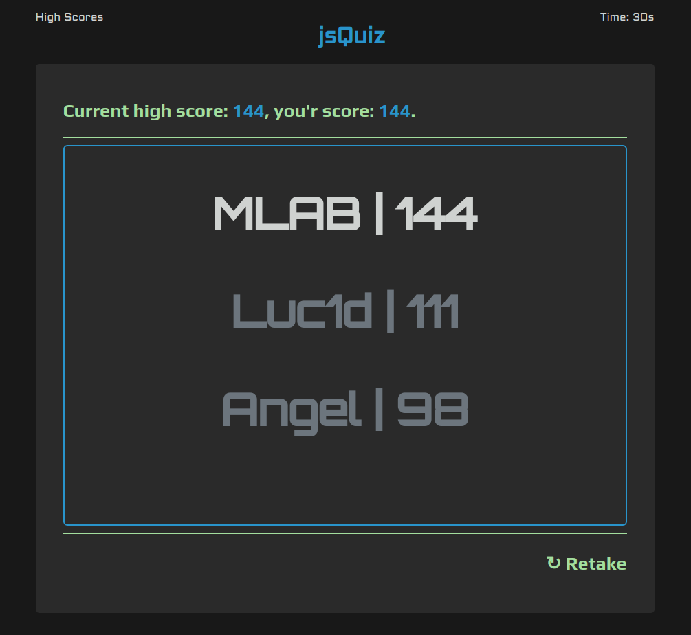

# JsQuiz

> Quiz concept written in pure JS/HTML/CSS.  

- [x] [Initital Setup](https://github.com/MBrassey/jsquiz/issues/1)
- [x] [Question & Answer Json](https://github.com/MBrassey/jsquiz/issues/2)
- [x] [Loop Through Questions](https://github.com/MBrassey/jsquiz/issues/3)
- [x] [Add Timer](https://github.com/MBrassey/jsquiz/issues/4) 
- [x] [High Score Persistence](https://github.com/MBrassey/jsquiz/issues/5)
- [x] [Stylize](https://github.com/MBrassey/jsquiz/issues/6)
- [x] [Bugfix & Final Changes](https://github.com/MBrassey/jsquiz/issues/7)
<h6>
[ Click the below image to view the <a href="https://MBrassey.github.io/jsQuiz/">webapplication</a> ]
</h6>

[
](https://MBrassey.github.io/jsQuiz/)